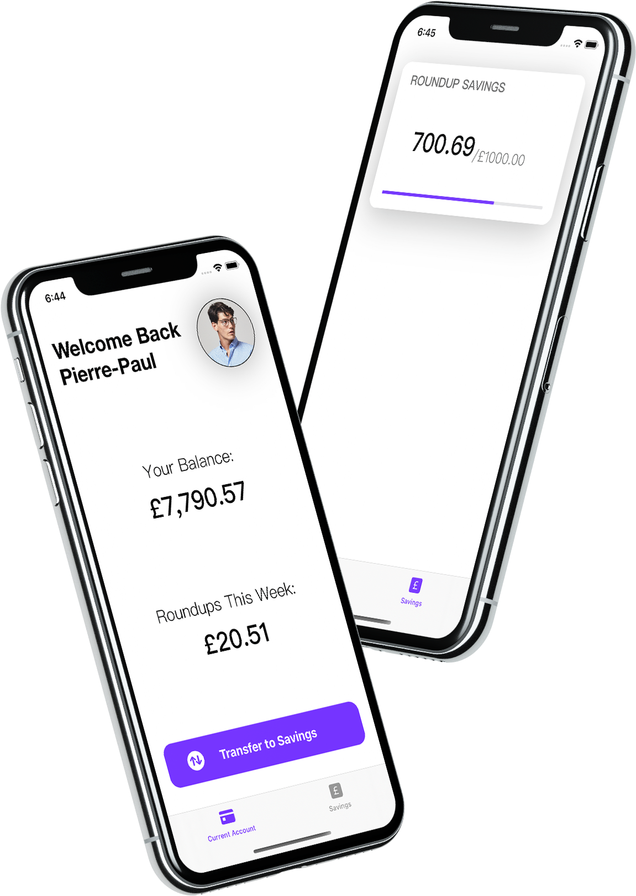
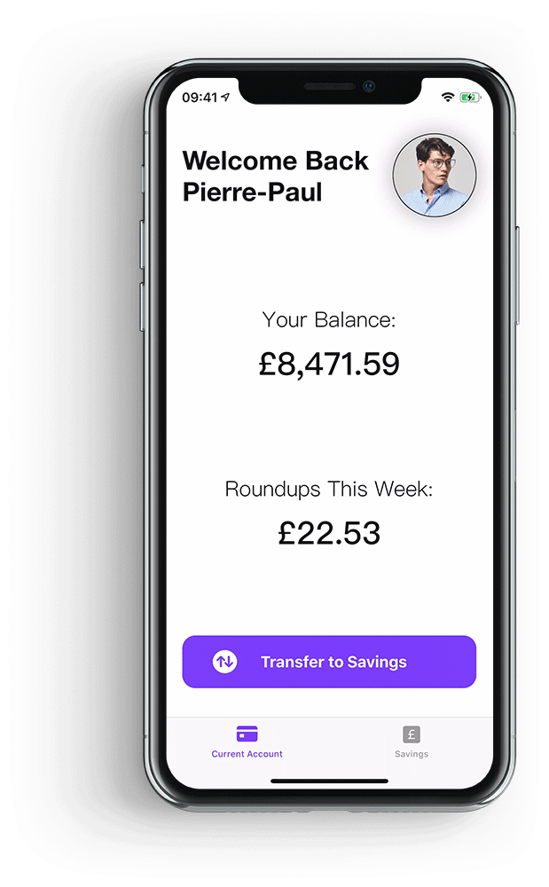

# Starling Savings

iOS application created as part of the Starling Bank technical challenge by Edward Theodor Danescu.

<p align="center">
  
</p>

## Getting Started

These instructions will get you a copy of the project up and running on your local machine for testing purposes.

### Prerequisites

First of all, clone this repository on your machine.

Then, if you have not already done so, please install **cocoapods** by running the following command in the terminal:

```
$ sudo gem install cocoapods
```

### Installing

Navigate to the repo directory locally and run:

```
pod install
```

This will add a pods folder to the directory, as well as the Starling Savings.xcworkspace file. Please only use this instead of the original Starling Savings.xcodeproj file from now on.

## Running the app

Open **Starling Savings.xcworkspace** and hit run. If you encounter any code signing issues, these should be easily solvable from the Signing and Capabilities tab in Starling Savings, under TARGETS in the project inspector.

### Startup



Upon starting up the app, you will find yourself in the **Current Account** tab, and you will see the balance and roundups labels update with a counting animation.

If you navigate over to the **Savings** tab, you will find a card view there representing the Roundup Saving Goal. This view will update showing the total amount deposited into the goal so far, along with a progress view representing the percentage out of the target amount.

### Transfer

Back in the Current Account tab, by tapping on the **Transfer to Savings** button, you should see the labels update once more, provided there were no errors.

The main account has now been charged with the roundups amount, and the funds transferred over to the saving goal.

On the right you can see a demonstration of the transfer procedure.

### Savings

After the transfer, the Savings View Controller will be notified it needs to update (through a global flag rather than the Notification Center).

Upon loading the Savings View Controller again, it will update the card view's elements accordingly to take into account the last transfer made.


## Design Decisions

### General Structure

* Two separate view controllers rather than just one, to better distinguish the main account from the saving goals.
* Focus on the main functionality required for the challenge, thus:
    * API calls only where necessary, such as for retrieving transactions, balance, transferring funds etc...
    * Assumptions were made, such as one account and one saving goal only per client.
    * Hard-coded profile image, goal id and goal target amount to cut down on API calls.

### Code

* Comments and documentation.
* Multiple phases of refactoring to ensure code quality and minimise duplication.
* Cohesion and loose coupling by keeping data retrieval, manipulation, and presentation in separate classes.
* Made use of powerful Swift language features such as escaping closures for asynchronous operations:
    ```
    func getClientName() {
        apiManager.getClientName { (name) in
            self.updateWelcomeBackLabel(withName: name)            
        }
    }
    ```

### User Interface

* The icon was obtained by inverting the colors of the original Staling app icon, to suggest a companion app.
* Designs were achieved by following Apple's Human Interface Guidelines. Starling's purple color was used for highlights.


## Acknowledgments

Date class extension by Sandeep: https://stackoverflow.com/a/33397770
